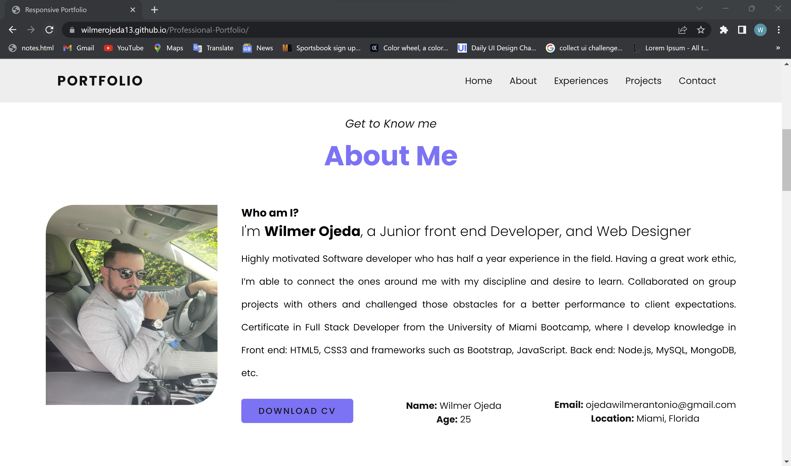

# Professional Portfolio

## Table of Contents

- [Description](#description)
- [Installation](#installation)
- [Usage](#usage)
- [Contribution](#contribution)
- [Testing](#testing)
- [Screenshot](#screenshot)

## Description:

Project based on creating a portfolio that showcase my work any my abilities to potential employers

## Installation:

We are going to go to the terminal and right click on the index.html to dispay the portfolio

## Usage:

We used the project by cloning the repo and and start the project by right click on the index.html

## License:

This license is public used you can find it on:
https://opensource.org/licenses/MIT

## Contribution:

Yes you can contribute to the project by sending me an email.

## Testing:

You can test the project by cloning the repository , and the next step your going to go the terminal and right click on the index.html to display the portfolio

## Screenshot:

#### Website [link](https://wilmerojeda13.github.io/Professional-Portfolio/)

## Contact Information:

- Github: https://github.com/wilmerojeda13.
- Email: ojedawilmerantonio@gmail.com.
